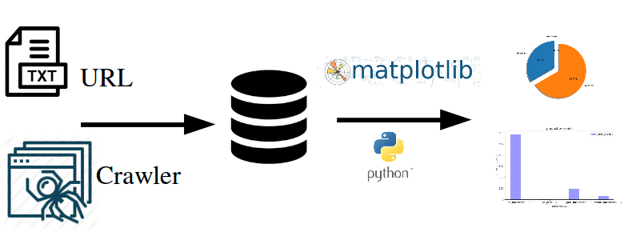
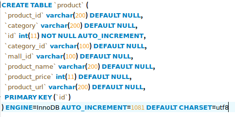
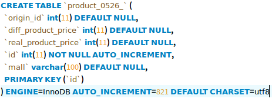
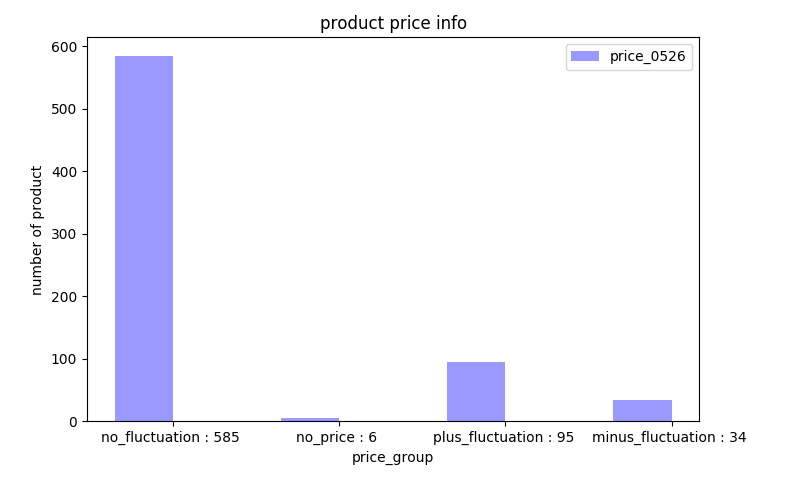
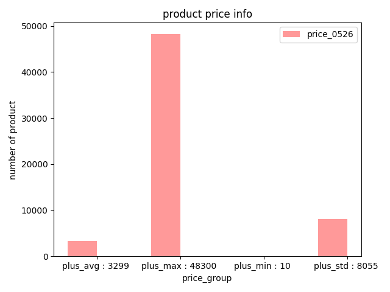
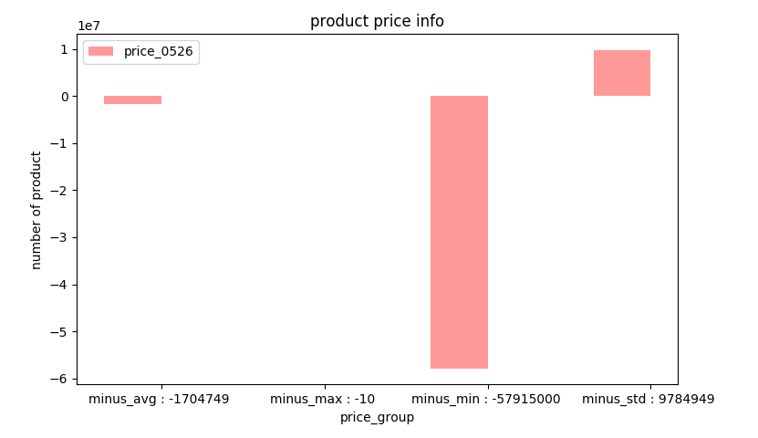
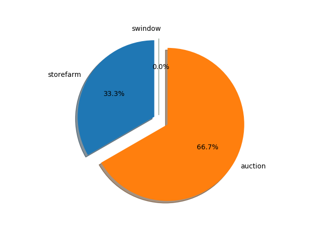

# 결과

주어진 데이터의 url 정보를 통해 해당 사이트의 가격 정보를 수집함

데이터 수집은 파이썬을 이용하였음(beautifulrSoup library 이용)
데이터는 매일 한번 씩 수집한다고 가정하고 테이블을 생성함
데이터베이스에서 결과를 가져와서 시각화 함

수집 결과 옥션, 스토어팜, swindow를 제외한 사이트에서는 수집이 되지않음
따라서 위의 세 사이트를 중점으로 하여 가격 정보를 수집 하였음
주어진 데이터의 가격과 수집한 데이터의 가격을 비교하여 아래의 네 가지 경우로 결과를 나누었음
- 상품이 존재하지 않는 경우(상품가격 정보를 가져올 수 없음)
- 상품의 가격이 주어진 데이터와 동일한 경우
- 상품의 가격이 주어진 데이터와 동일하지 않은 경우(가격이 올라간 경우, 가격이 내려간 경우)
 

## 구조
- table product schema

- table product_05_ chema

### 시각화 결과
- visual_1.py 의 결과

- visual_2.py 의 결과

- visual_3.py 의 결과

- visual_4.py 의 결과

